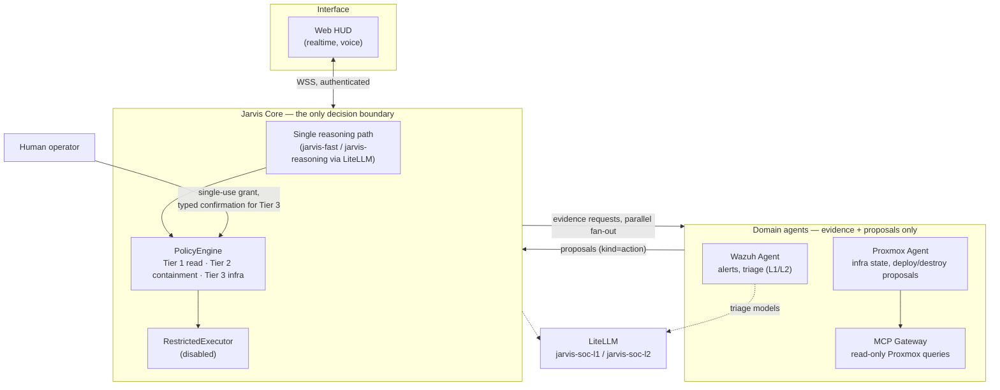

# J.A.R.V.I.S

**A security-first, multi-agent SOC assistant — self-hosted, one governed brain, many evidence sources.**

JARVIS observes infrastructure and security signals across a homelab (Proxmox, Wazuh, Prometheus), reasons about them through a single governed Core, and proposes — but never silently executes — actions. Every capability is tiered by risk, every action requires a human-issued, single-use grant, and every domain agent can only gather evidence and propose — authorization lives in exactly one place.

---

## Why this exists

Most "AI SOC" demos wire an LLM straight into infrastructure and hope for the best. JARVIS is built around the opposite assumption: **the model is never the thing that decides whether something happens.** A tiered policy engine is. The architecture in one sentence:

> Domain agents observe and propose. Jarvis Core reasons and decides. A human authorizes. Nothing executes without all three.

## Architecture

No agent — not Wazuh, not Proxmox, not the reasoning model itself — has a path to production infrastructure that skips the PolicyEngine. `RestrictedExecutor` is deployed and deliberately disabled: the whole authorization chain (evidence → proposal → policy evaluation → human grant → execution → audit) is live and tested end-to-end, right up to the point of actually changing anything.

## What's real today

See [`STATUS.md`](STATUS.md) for the full, evidence-backed breakdown (every claim there cites a test name, commit, or production check — nothing is asserted without it). Summary:

| Layer | State |
|---|---|
| Core API, sessions, deny-by-default auth | ✅ Implemented, tested, in production |
| Tiered `PolicyEngine` (1/2/3) + single-use human grants | ✅ Implemented, tested |
| Wazuh Agent (proposal-only, tier-2 containment) | ✅ Implemented, tested |
| Proxmox Agent (proposal-only, tier-3 infra) | ✅ Implemented, tested |
| Cross-domain evidence fan-out (parallel, latency-budgeted) | ✅ Implemented, tested |
| GPU-accelerated local inference (Vulkan/RADV) | 🚧 In progress, unmerged branch |
| `RestrictedExecutor` (actual write/execute capability) | ⛔ Deployed, deliberately disabled |
| Infrastructure knowledge (RAG) | 🚧 In progress, unmerged branch |
| Persistent memory | 📋 Planned, not started |

Rows marked "tested" (without "in production") are backed by passing tests and a merged commit, but have not yet been confirmed running in the live deployment — see `STATUS.md` for the exact production-vs-test evidence split.

## Design principles

- **One brain, many evidence sources.** Only Core's `ConversationService` forms verdicts and decides routing. Every domain agent — Wazuh, Proxmox, and whatever comes next — exposes read tools and a declared set of *proposable* capabilities. None of them reason independently or call a model on their own outside Core's governed path.
- **Capability tiers, not one-size-fits-all authorization.** Reading is free. Reversible containment (blocking an IP, isolating a host) needs one human and a 5-minute single-use grant. Creating or destroying infrastructure needs a typed confirmation of the exact resource name, a mandatory rollback plan, and a 2-minute window.
- **Deny-by-default, fail-closed everywhere.** Unknown capability → denied. Expired grant → denied. Executor disabled → denied. The safe outcome is always the default, never an opt-in.
- **Documentation is evidence, not aspiration.** Nothing in this repo's docs describes a feature as done unless it's backed by a merged commit and a passing test — see [`STATUS.md`](STATUS.md) and the [ADR log](docs/adr/) for the audit trail.

## Development

Web UI requirements: Node.js/npm.

    cd apps/desktop
    npm ci
    npm test
    npm run build
    npm run dev

The generated `dist/` is a static Web UI, served same-origin behind Nginx. After exchanging an operator access key for a bounded HttpOnly session, it uses authenticated commands, realtime telemetry, security alerts, and voice — without ever exposing service credentials to JavaScript.

The transitional Tauri client additionally requires Rust and native Tauri dependencies:

    cd apps/desktop
    cargo test --manifest-path src-tauri/Cargo.toml
    npm run tauri dev

## Learn more

- [Architecture](docs/architecture.md) — full system diagram and trust boundary
- [ADR log](docs/adr/) — every architectural decision, with acceptance status and evidence
- [Roadmap](docs/roadmap.md)
- [Security policy](SECURITY.md)
- [`STATUS.md`](STATUS.md) — the single source of truth for what's actually implemented, tested, or pending

There is no direct LLM-to-shell path, anywhere in this system.
