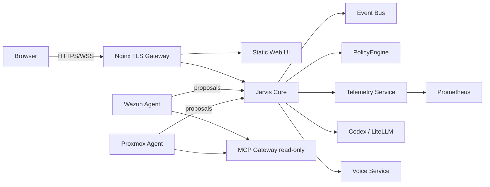

# Architecture

## System boundary

The browser depends only on same-origin Web UI, API and WebSocket routes
exposed by Nginx. It never receives internal service addresses, provider
credentials, infrastructure credentials, or OpenBao access.

## The authorization chain

Every capability in the system — read, contain, or destroy — is evaluated
through the same chain, with no shortcuts:
`RestrictedExecutor` is deployed today and intentionally returns
`EXECUTOR_DISABLED` unconditionally. The rest of the chain — including the
human-authorization step — is implemented and exercised end-to-end by tests
covering both Wazuh Agent and Proxmox Agent proposals; only the final
execution step is gated shut on purpose (see
[ADR-014](adr/ADR-014-multi-agent-architecture.md)). Production deployment
status for each stage of the chain is tracked separately in
[`STATUS.md`](../STATUS.md).

## Capability tiers (ADR-014)

| Tier | Examples | Authorization |
|---|---|---|
| 1 — read-only | `wazuh.alerts.read`, `proxmox.guest.status`, `core.health.read` | None |
| 2 — reversible containment | `security.user.disable`, `security.ip.block`, `security.host.isolate` | One human, single-use grant, 5-minute expiry |
| 3 — infrastructure create/destroy | `proxmox.vm.deploy`, `proxmox.vm.destroy`, `proxmox.ct.destroy` | One human, typed confirmation of the exact resource name, mandatory `rollback_plan`, 2-minute expiry |

The full, machine-readable catalog lives in `contracts/data/capabilities.json`.
A domain agent can only *propose* a capability declared as its own; it can
never issue its own authorization grant — enforced in code and covered by
`domain_agent_cannot_issue_its_own_grant` and
`domain_agent_cannot_submit_human_confirmation`.

## One brain, many evidence sources

Jarvis Core's `ConversationService` is the only place that forms a
verdict or decides what to do next. Every domain agent — Wazuh Agent,
Proxmox Agent, and any future agent — follows the same shape: it exposes
read tools over its own domain and a declared set of proposable
capabilities, and nothing else. None of them call a reasoning model
independently; Wazuh Agent's own L1/L2 triage uses scoped LiteLLM aliases
(`jarvis-soc-l1`, `jarvis-soc-l2`) for classification, but the capability
proposals it emits are evaluated exclusively by Core's `PolicyEngine`, not
by the agent itself.

When a question needs evidence from more than one domain (e.g. "is the DC
down, and were there any recent alerts on it"), Core requests it from all
relevant agents concurrently — not sequentially — with an explicit, bounded
timeout on every downstream call (`JARVIS_CODEX_TASK_TIMEOUT_SECONDS`,
enforced between 10s and 600s) rather than an unbounded wait. See
`cross_domain_evidence_is_requested_concurrently` and
`audit_ids_remain_unique_during_concurrent_fan_out` for the enforced
behavior.

## Current implementation state

This section intentionally stays short — [`STATUS.md`](../STATUS.md) is the
canonical, evidence-cited source of truth for what's implemented, tested,
or still pending, and is updated every time a stage lands. Don't duplicate
that table here; it will drift.

## Infrastructure

Workloads run in isolated Proxmox LXCs/VMs with explicit firewall rules
(`deploy/nftables/`). No service is public unless a documented requirement,
threat review, and authorization justify exposure. Proxmox guest/service
state is exported into Prometheus via a textfile collector — see
[ADR-011](adr/ADR-011-proxmox-textfile-exporter.md). GPU-accelerated local
inference (Ollama, Vulkan/RADV) on a dedicated passthrough LXC is in
progress on an unmerged branch and is not yet part of this baseline.
