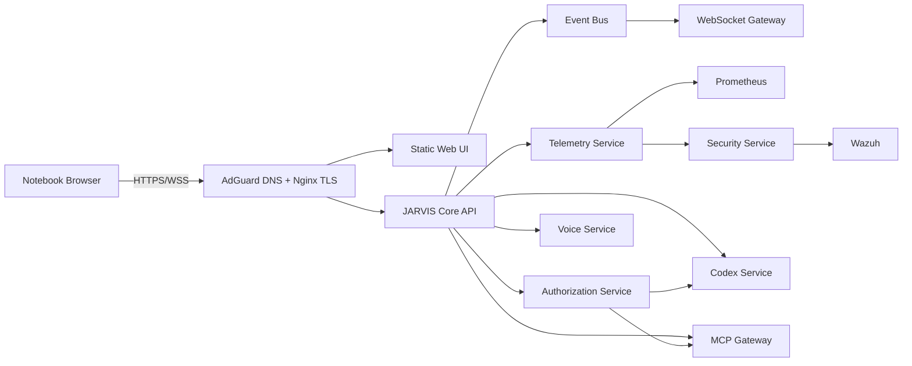

# Architecture

## Target system boundary

The browser depends only on same-origin Web UI, API and WebSocket routes exposed by Nginx. It never receives internal service addresses, provider credentials, infrastructure credentials or OpenBao access.

## Current feature state

The Web UI and Core gateway foundation are implemented. The frontend selects a runtime-neutral client: Tauri retains its native HTTPS credential boundary, while a normal browser uses same-origin HTTP and can currently access only minimal health. Authenticated browser commands intentionally remain blocked until secure server-side sessions are implemented. Conversation responses in the transitional Tauri path remain explicitly mock-only and no model, executor or downstream service is connected.

The browser does not collect host telemetry. The previous Tauri `sysinfo` path remains available only for transitional compatibility; server telemetry will arrive through the future Event Bus and WebSocket Gateway.

The server Event Bus and authenticated WebSocket Gateway provide normalized snapshots, incremental envelopes, heartbeat and slow-consumer resynchronization. The browser client connects only after validating an existing server session, applies realtime state and Agent Matrix updates, backs off with jitter and suspends work in background tabs. Trusted session issuance remains intentionally unresolved; the gateway does not downgrade to anonymous access.

The Telemetry Service now owns the operational observability boundary. Source adapters return a strict normalized model, invalid samples are rejected, and only bounded events reach the browser. The initial Prometheus adapter is explicitly unavailable until runtime connectivity is configured; it does not generate mock CPU, memory or network values.

Other external components remain boundaries and mocks. Future services communicate through versioned contracts in contracts/.

Infrastructure workloads will run in isolated Proxmox VMs/LXCs with explicit firewall rules. No service is public unless a documented requirement, threat review and authorization justify exposure.
