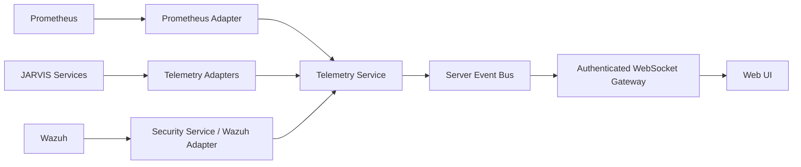

# Telemetry architecture

JARVIS separates operational observability from security telemetry.

The browser never queries Prometheus or Wazuh. Adapters map source-specific responses into bounded versioned contracts before publication. Invalid samples are rejected and only a sanitized source status is emitted.

## Operational contract

`telemetry.snapshot` contains:

- CPU utilization;
- memory used and total;
- 1/5/15-minute load averages;
- filesystem used and total;
- disk read/write rates;
- network receive/transmit rates;
- uptime;
- bounded temperature readings;
- normalized host and kernel identifiers.

The Telemetry Service interval is bounded between 2 seconds and 5 minutes and defaults to 10 seconds. Missed ticks are skipped instead of accumulated. This avoids bursts after a slow source or scheduler pause.

## Current adapters

The deployed Prometheus adapter reads the private collector at `192.168.1.24:9090` and normalizes the Proxmox host (`server-central`) as the primary operational host. Its queries are fixed in the Core, execute concurrently, and use bounded connection and request deadlines. The configured instance label is validated before it can enter a query. A partial or invalid collection produces only `telemetry.source.status`; it never produces fabricated metrics.

Prometheus scrapes node exporters for the Proxmox server, n8n, LiteLLM, OpenBao, JARVIS Core, Voice Engine, MCP Gateway, and Prometheus itself every 15 seconds. Port 9090 is not routed through Nginx and its host firewall accepts API access only from JARVIS Core. The Proxmox exporter uses systemd IP filtering to accept only the Prometheus collector.

The browser consumes only normalized `telemetry.snapshot` events through the authenticated WebSocket gateway. It has no route or credentials for Prometheus.

The initial retention is bounded to seven days and 2 GB because CT127 has a 4 GB root volume. Increase the disk before increasing either retention limit. One vCPU and 2 GB RAM are sufficient for the current seven-node scrape set; capacity should be revisited if cardinality, scrape targets, or recording rules grow materially.

The read-only Wazuh relay and Prometheus availability poller normalize security and service-down alerts into the same bounded Event Bus. Jarvis can summarize recent deduplicated alerts, filter critical or host-specific availability events, and offer a separately confirmed Codex remediation assessment. The confirmation is scoped to one conversation, expires after five minutes and does not authorize or execute an infrastructure change.
# Wazuh security telemetry

JARVIS recibe alertas de Wazuh mediante un relay interno de solo lectura en
`192.168.1.10:5515`. El relay lee únicamente `alerts.json`, normaliza severidad,
título y descripción, y exige un bearer token de servicio. Core consulta el
relay en segundo plano y publica `telemetry.source.status`,
`security.telemetry.updated` y `security.alert` por el WebSocket autenticado.

El navegador nunca accede a Wazuh, al indexer ni al relay. No se habilitan
acciones de respuesta desde este canal: las alertas son únicamente observación y
cualquier acción futura deberá atravesar Policy/Authorization/MCP.

El Core debe definir `JARVIS_WAZUH_RELAY_URL` y cargar la credencial systemd
`wazuh-relay-token`. Si se configura la URL pero la credencial falta o es inválida,
el Core falla al iniciar; esto evita operar sin alertas de forma inadvertida.
